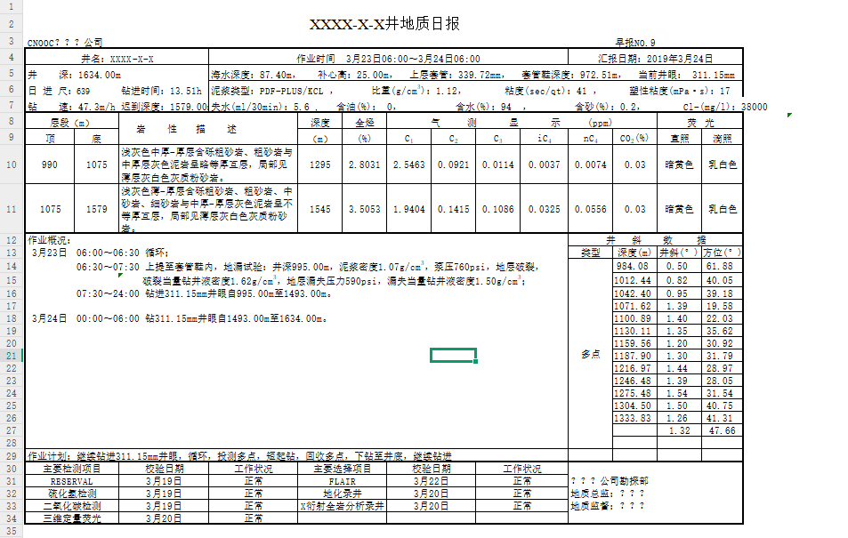
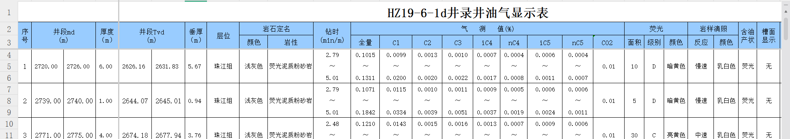
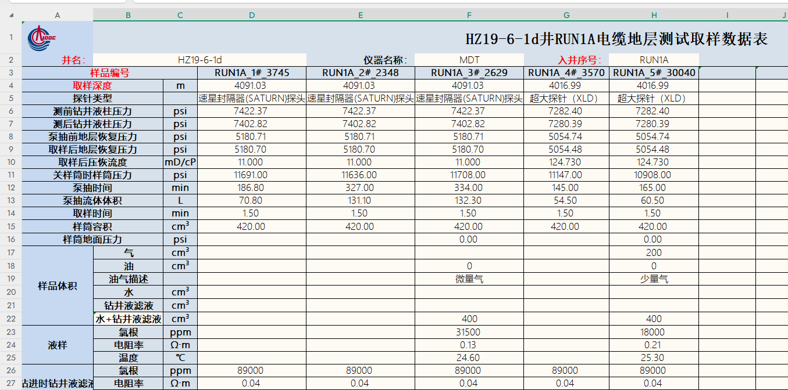

# ExcelShift 使用文档

## 1. 简介

ExcelShift是一个基于配置的excel数据提取框架，该框架支持多种数据提取模式，包括单个对象、普通列表、行组列表以及垂直列表等。

## 2. 项目结构

```
ExcelShift4/
├── src/
│   └── main/
│       ├── java/
│       │   └── com/
│       │       └── excel/
│       │           └── shift/
│       │               ├── excel/           # 核心提取器实现
│       │               ├── model/           # 数据模型类
│       │               ├── result/          # 结果处理类
│       │               └── util/            # 工具类
│       └── resources/                      # 配置文件目录
└── pom.xml                                 # 项目依赖管理
```

## 3. 快速开始

### 3.1 添加依赖

在您的`pom.xml`中添加以下依赖：

```xml
<dependency>
    <groupId>com.excel.shift</groupId>
    <artifactId>ExcelShift</artifactId>
    <version>1.0-SNAPSHOT</version>
</dependency>
```

### 3.2 创建配置文件

首先创建一个JSON配置文件来定义数据映射规则。例如：

```json
{
  "wellTestData": {
    "targetClass": "com.your.package.WellTestData",
    "description": "井测试数据提取配置",
    "order": 1,
    "resultType": "LIST",   // 代表返回类型为list类型
    "startRow": "5",
    "startColumn": "A",
    "endRow": null,
    "table": {
      "columns": {
        "depthMd": {
          "order": 1,
          "javaFieldName": "depthMd",
          "javaFieldType": "Double",
          "columnCell": "E",
          "description": "深度(MD) m"
        },
        "sandBody": {
          "order": 2,
          "javaFieldName": "sandBody",
          "javaFieldType": "String",
          "columnCell": "C",
          "description": "砂体",
          "isMergeType": true
        }
      }
    }
  }
}
```

### 3.3 创建数据模型类

创建与配置对应的Java实体类：

```java
@Data
public class WellTestData {
    private Double depthMd;   // 深度(MD)
    private String sandBody;  // 砂体
    // 其他字段...
}
```

### 3.4 使用ExcelExtractor提取数据

```java
// 指定Excel文件路径
String excelPath = "path/to/your/excel/file.xlsx";
// 配置文件路径
String configPath = "path/to/your/config.json";

// 需要提取的类列表
List<Class<?>> classList = new ArrayList<>();
classList.add(WellTestData.class);

// 创建提取器
ExcelExtractor extractor = new ExcelExtractor(excelPath, configPath, classList);

// 提取指定工作表的数据  
SheetExtractionResult result = extractor.extractSheetByIndex(0); // 解析第一个excel的sheet

// 获取提取结果
if (result.isSuccess()) {
    List<WellTestData> dataList = result.getResultList(WellTestData.class);   // 如果是single类型的类，那么使用getResult 来接受单个对象。
    // 处理提取的数据
    dataList.forEach(System.out::println);
}

// 或者提取excel所有工作表数据 适用于与当前配置一样的sheet否则只有部分成功。 
ExtractionResult allResults = extractor.extractAllSheet();
```

## 4. 配置文件详解

### 4.1 提取器类型

ExcelShift支持四种提取器类型说明我们以这个日报举例说明：



- **SINGLE**：提取单个对象，如表头、表格概述等 例如标题、某某公司等信息

- **LIST**：提取普通表格数据，每行对应一个对象  例如上面图中的井斜数据、作业计划等等

- **GROUP_LIST**：提取行组数据，多行组成一个对象 如下   4、5、6 三行组成一个逻辑上的对象。

  

- **VERTICAL_LIST**：提取垂直表格数据，每列对应一个对象，每行是对象的不同属性 如下图

  

### 4.2 配置项说明

配置文件的完整示例结构如下，一个配置文件可以包含多个单个类的配置：   

```json
{
  "extractorId": {                    // 提取器唯一标识 用于动态表达式计算的引用
    "targetClass": "com.example.Data", // 目标Java类的全限定名，必填
    "description": "配置描述",         // 配置描述，用于说明该提取器的用途
    "order": 1,                       // 提取器执行顺序，必填，数字越小越先执行
    "resultType": "LIST",             // 结果类型，必填，可选值：SINGLE/LIST/GROUP_LIST/VERTICAL_LIST  一个类只能选则一种        
     // 注意:startRow是以直接数据行作为设置的 例如数据从第一行开始那么startrow为1 而不是他的表头行。其余定位也是如此以数据行作为起始来设置位置信息。
    "startRow": "5",                  // 开始行号，从1开始计数 如果通过startFlag进行确定，则设置为null  否则必填 可以填动态表达式
    "startColumn": "A",               // 开始列名，使用Excel列名(A,B,C...) 
    "endRow": null,                   // 结束行号，可选，null表示动态计算 如果通过endFlag进行确定，则设置为null 否则必填 可以填动态表达式
    "endColumn": null,                // 结束列名，可选，用于VERTICAL_LIST类型
    "isDynamic": true,                // 类里面是否包含动态表达式的计算 例如{operationRecord1.endRow + 1} 默认false
    "isDynamicRows": true,            // 表格结束行数不确定并且下方 包含其他的结构 需要结合endFlag，startflag来使用来确定endRow或者startRow ，startFlag和endFlag 其中之一不为null则该值必须为true
    "groupRowCount": 3,               // 每组包含的行数，仅用于GROUP_LIST类型
    "startFlag": {                    // 开始标志配置，用于动态范围识别起始行 结合isDynamicRows使用
      "text": "作业概况",             // 标志文本
      "columnCell": "B"               // 标志所在列
    },
    "endFlag": {                      // 结束标志配置，用于动态范围识别结束行 结合isDynamicRows使用
      "text": "作业计划",             // 标志文本
      "columnCell": "B"               // 标志所在列
    },
    "fields": {                       // SINGLE类型的字段映射
      "fieldName": {    // 对应的实体类属性名最好和下面javaFieldName 保持一致
        "order": 1,                   // 字段顺序，必填
        "javaFieldName": "fieldName", // Java类中的字段名，必填
        "javaFieldType": "String",    // Java字段类型，必填
        "excelCell": "B4",           // Excel单元格坐标，必填 可以包含动态表达式例如"C${operationRecord1.endRow + 1}",
        "description": "字段描述",    // 字段描述
        "extractPattern": "井名：(.*)", // 正则表达式提取模式
        "defaultValue": ""           // 默认值
      }
      ...   // 下面还可以包含其余类似的filed字段
    },
    "table": {                        // LIST/GROUP_LIST/VERTICAL_LIST类型的字段映射
      "columns": {
        "fieldName": { // 对应的实体类属性名最好和下面javaFieldName 保持一致
          "order": 1,                 // 字段顺序，必填
          "javaFieldName": "fieldName", // Java类中的字段名，必填
          "javaFieldType": "String",  // Java字段类型，必填
          "columnCell": "A",         // Excel列名，用于LIST和GROUP_LIST类型
          "rowCell": "3",            // Excel行号，用于VERTICAL_LIST类型   用于确定垂直的excel的字段的行
          "groupRowIndex": 1,        // 组内行索引，仅用于GROUP_LIST类型 表示在组内的第几行取数据
          "description": "字段描述",  // 字段描述
          "unit": "m",               // 单位
          "extractPattern": "正则表达式", // 正则表达式提取模式
          "defaultValue": "默认值",   // 默认值
          "isMergeType": true        // 是否为合并单元格   如果是合并单元格并且当前数据null，就会默认向上查询到第一个值作为当前的值
        }
      }
    }
  }
 "extractor2": {   // 第二个类结构配置与上面类似，下面还可以定义其余类的配置
    ...
	}
}
```

## 5. 高级功能

### 5.1 合并单元格处理

通过设置`isMergeType: true`，ExcelShift可自动处理合并单元格，从上方单元格提取数据。

### 5.2 正则表达式提取

使用`extractPattern`配置项可从单元格文本中提取指定模式的数据：

```json
"extractPattern": "井\\s*深：(\\d+\\.?\\d*)m"
```

### 5.3 动态范围识别

可通过设置开始和结束标志自动识别数据范围：

```json
"startFlag": {
  "text": "作业概况",
  "columnCell": "B"
},
"endFlag": {
  "text": "作业计划",
  "columnCell": "B"
}
```

### 5.4外部创建配置对象然后传入 

除了通过配置文件路径创建提取器外，还可以预先创建和修改配置对象：

```java
// 创建配置对象
ExcelMappingConfig config = new ExcelMappingConfig(configPath);
// 可以对配置进行修改
// ...

// 使用配置对象创建提取器
ExcelExtractor extractor = new ExcelExtractor(excelPath, config, classList);
```

## 6. 支持的数据类型

ExcelShift支持以下Java数据类型的自动转换：

- `String`：字符串
- `Integer/int`：整数
- `Long/long`：长整数
- `Double/double`：双精度浮点数
- `Float/float`：单精度浮点数
- `Boolean/boolean`：布尔值

## 7. 常见使用场景

### 7.1 提取表头数据或单个对象(SINGLE)

```json
{
  "reportHeader": {
    "targetClass": "com.example.ReportHeader",
    "resultType": "SINGLE",
    "fields": {
      "wellName": {
        "javaFieldName": "wellName",
        "javaFieldType": "String",
        "excelCell": "B4",
        "extractPattern": "井名：(.*)"
      }
    }
  }
}
```

### 7.2 提取表格数据(LIST)

```json
{
  "gasTestData": {
    "targetClass": "com.example.GasTestData",
    "resultType": "LIST",
    "startRow": "10",
    "table": {
      "columns": {
        "depth": {
          "javaFieldName": "depth",
          "javaFieldType": "Double",
          "columnCell": "A"
        },
        "totalGas": {
          "javaFieldName": "totalGas",
          "javaFieldType": "Double",
          "columnCell": "B"
        }
      }
    }
  }
}
```

### 7.3 提取行组数据(GROUP_LIST)

```json
{
  "wellLoggingData": {
    "targetClass": "com.example.WellLoggingData",
    "resultType": "GROUP_LIST",
    "startRow": "5",
    "groupRowCount": 3,
    "table": {
      "columns": {
        "depthStart": {
          "javaFieldName": "depthStart",
          "javaFieldType": "Double",
          "columnCell": "C",
          "groupRowIndex": 1
        },
        "c1Min": {
          "javaFieldName": "c1Min",
          "javaFieldType": "Double",
          "columnCell": "H",
          "groupRowIndex": 2
        }
      }
    }
  }
}
```

### 7.4 提取垂直表格数据(VERTICAL_LIST)

```json
{
  "sampleData": {
    "targetClass": "com.example.SampleData",
    "resultType": "VERTICAL_LIST",
    "startRow": "3",
    "startColumn": "D",
    "table": {
      "columns": {
        "sampleCode": {
          "javaFieldName": "sampleCode",
          "javaFieldType": "String",
          "rowCell": "3"
        },
        "sampleDepth": {
          "javaFieldName": "sampleDepth",
          "javaFieldType": "Double",
          "rowCell": "4"
        }
      }
    }
  }
}
```

## 8. 实际应用示例

### 8.1 提取钻井报告数据

```java
public class DrillReportExample {
    public static void main(String[] args) {
        String excelPath = "path/to/drill_report.xls";
        String configPath = "src/main/resources/originalConfig.json";
        
        List<Class<?>> classList = new ArrayList<>();
        classList.add(DrillReport.class);
        classList.add(OperationRecord.class);
        classList.add(SelectedItem.class);
        classList.add(InspectionItem.class);
        classList.add(WellDeviationData.class);
        classList.add(LayerDescription.class);
        classList.add(GasTestData.class);
        
        ExcelExtractor extractor = new ExcelExtractor(excelPath, configPath, classList);
        SheetExtractionResult result = extractor.extractSheetByIndex(9);
        
        if (result.isSuccess()) {
            // 获取钻井报告基本信息
            DrillReport report = result.getResult(DrillReport.class);
            
            // 获取各种列表数据
            List<OperationRecord> records = result.getResultList(OperationRecord.class);
            List<LayerDescription> layerDescriptions = result.getResultList(LayerDescription.class);
            List<GasTestData> gasData = result.getResultList(GasTestData.class);
            List<InspectionItem> inspectionItems = result.getResultList(InspectionItem.class);
            List<SelectedItem> selectedItems = result.getResultList(SelectedItem.class);
            List<WellDeviationData> deviationData = result.getResultList(WellDeviationData.class);
            
            // 处理提取的数据
            System.out.println("钻井报告基本信息：");
            System.out.println(report);
            
            System.out.println("\n作业记录：");
            records.forEach(System.out::println);
            
            // ... 处理其他数据
        }
    }
}
```

### 8.2 提取电缆地层测试数据

```java
public class CableLayerSampleDataExample {
    public static void main(String[] args) {
        String excelPath = "path/to/cable_layer_test.xlsx";
        String configPath = "src/main/resources/verticalConfig.json";
        
        List<Class<?>> classList = new ArrayList<>();
        classList.add(CableLayerSampleData.class);
        classList.add(SampleVolume.class);
        
        ExcelExtractor extractor = new ExcelExtractor(excelPath, configPath, classList);
        SheetExtractionResult result = extractor.extractSheetByIndex(1);
        
        if (result.isSuccess()) {
            // 获取样品数据
            List<CableLayerSampleData> sampleData = result.getResultList(CableLayerSampleData.class);
            List<SampleVolume> volumeData = result.getResultList(SampleVolume.class);
            
            System.out.println("样品数据：");
            sampleData.forEach(System.out::println);
            
            System.out.println("\n体积数据：");
            volumeData.forEach(System.out::println);
        }
    }
}
```

## 9. 常见问题

### 9.1 如何处理合并单元格？

对于合并单元格，有两种处理方式：

1. 使用`isMergeType: true`配置，自动从上方单元格获取数据
2. 使用`extractPattern`配置，从合并单元格文本中提取所需数据

### 9.2 如何动态识别数据范围？

通过配置`startFlag`和`endFlag`，可以动态识别数据范围：

```json
{
  "isDynamic": true,
  "isDynamicRows": true,
  "startFlag": {
    "text": "作业概况",
    "columnCell": "B"
  },
  "endFlag": {
    "text": "作业计划",
    "columnCell": "B"
  }
}
```

### 9.3 如何处理垂直表格数据？

对于垂直表格，使用`VERTICAL_LIST`类型，并使用`rowCell`指定行号：

```json
{
  "resultType": "VERTICAL_LIST",
  "startColumn": "D",
  "table": {
    "columns": {
      "fieldName": {
        "javaFieldName": "fieldName",
        "javaFieldType": "String",
        "rowCell": "3"
      }
    }
  }
}
```

## 10. 常用函数列表

### 10.1 ExcelExtractor 构造函数

```java
// 方式1：使用配置文件路径创建
public ExcelExtractor(String excelPath, String configPath, List<Class<?>> classList)

// 方式2：使用配置对象创建
public ExcelExtractor(String excelPath, ExcelMappingConfig config, List<Class<?>> classList)
```

参数说明：
- `excelPath`：Excel文件路径
- `configPath`：配置文件路径
- `config`：ExcelMappingConfig配置对象
- `classList`：需要提取的类列表

### 10.2 数据提取方法

```java
// 提取所有工作表数据  适用于一个excel文件里面的所有sheet结构相同的情况，否则只有部分会成功
public ExtractionResult extractAllSheet()

// 提取指定索引的工作表数据
public SheetExtractionResult extractSheetByIndex(int sheetIndex)

// 提取指定名称的工作表数据
public SheetExtractionResult extractSheetByName(String sheetName)
```

### 10.3 结果获取方法

```java
// 获取单个对象结果
public <T> T getResult(Class<T> clazz)

// 获取对象列表结果
public <T> List<T> getResultList(Class<T> clazz)

// 获取提取是否成功
public boolean isSuccess()
```

### 10.4 使用示例

```java
// 1. 基本使用
ExcelExtractor extractor = new ExcelExtractor(excelPath, configPath, classList);
SheetExtractionResult result = extractor.extractSheetByIndex(0);
if (result.isSuccess()) {
    List<WellTestData> dataList = result.getResultList(WellTestData.class);
}

// 2. 提取多个工作表
ExtractionResult allResults = extractor.extractAllSheet();
for (SheetExtractionResult sheetResult : allResults.getSheetResults()) {
    if (sheetResult.isSuccess()) {
        // 处理每个工作表的数据
    }
}
```

### 10.5 配置对象操作

```java
// 创建配置对象
ExcelMappingConfig config = new ExcelMappingConfig(configPath);

// 获取所有提取器配置
List<ExtractorConfig> extractors = config.getAllExtractors();

// 获取指定ID的提取器配置
ExtractorConfig extractor = config.getExtractor("extractorId");

// 获取配置描述
String description = extractor.getDescription();

// 获取目标类
String targetClass = extractor.getTargetClass();

// 获取结果类型
String resultType = extractor.getResultType();
```

### 10.6 注意事项

1. 数据提取顺序：
   - 按照配置文件中`order`字段指定的顺序执行
   - 数字越小越先执行
   - 建议按照数据依赖关系设置顺序
2. 错误处理：
   - 始终检查`isSuccess()`返回值


