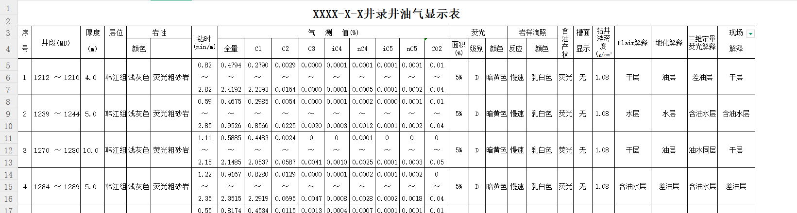

# ExcelShift 使用文档

## 1. 简介

ExcelShift是一个基于配置解析的excel数据提取框架，该框架使用easyexcel作为底层解析库，支持多种数据提取模式，包括单个对象、普通列表、行组列表以及垂直列表等。

## 2. 项目结构

```
ExcelShift4/
├── src/
│   └── main/
│       ├── java/
│       │   └── com/
│       │       └── excel/
│       │           └── shift/
│       │               ├── excel/           # 核心提取器实现
│       │               ├── model/           # 数据模型类
│       │               ├── result/          # 结果处理类
│       │               └── util/            # 工具类
│       └── resources/                      # 配置文件目录
└── pom.xml                                 # 项目依赖管理
```

## 3. 快速开始

### 3.1 添加依赖

在您的`pom.xml`中添加以下依赖：

```xml
<dependency>
    <groupId>com.excel.shift</groupId>
    <artifactId>ExcelShift</artifactId>
    <version>1.0-SNAPSHOT</version>
</dependency>
```

### 3.2 创建配置文件

首先创建一个JSON配置文件来定义数据映射规则。配置文件的配置请参考4、5、6三章以及6.7章具体使用案例就行配置。例如： 

```json
{
  "wellTestData": {
    "targetClass": "com.your.package.WellTestData",
    "description": "井测试数据提取配置",
    "order": 1,
    "resultType": "LIST",   // 代表返回类型为list类型
    "startRow": "5",
    "startColumn": "A",
    "endRow": null,
    "table": {
      "columns": {
        "depthMd": {
          "order": 1,
          "javaFieldName": "depthMd",
          "javaFieldType": "Double",
          "columnCell": "E",
          "description": "深度(MD) m"
        },
        "sandBody": {
          "order": 2,
          "javaFieldName": "sandBody",
          "javaFieldType": "String",
          "columnCell": "C",
          "description": "砂体",
          "isMergeType": true
        }
      }
    }
  }
}
```

### 3.3 创建数据模型类

创建与配置对应的Java实体类：

```java
@Data
public class WellTestData {
    private Double depthMd;   // 深度(MD)
    private String sandBody;  // 砂体
    // 其他字段...
}
```

### 3.4 使用ExcelExtractor提取数据

```java
// 指定Excel文件路径
String excelPath = "path/to/your/excel/file.xlsx";
// 配置文件路径
String configPath = "path/to/your/config.json";

// 需要提取的类列表
List<Class<?>> classList = new ArrayList<>();
classList.add(WellTestData.class);

// 创建提取器
ExcelExtractor extractor = new ExcelExtractor(excelPath, configPath, classList);

// 提取指定工作表的数据  
SheetExtractionResult result = extractor.extractSheetByIndex(0); // 解析第一个excel的sheet

// 获取提取结果
if (result.isSuccess()) {
    List<WellTestData> dataList = result.getResultList(WellTestData.class);   // 如果是single类型的类，那么使用getResult 来接受单个对象。
    // 处理提取的数据
    dataList.forEach(System.out::println);
}

// 或者提取excel所有工作表数据 适用于与当前配置一样的sheet否则只有部分成功。 
ExtractionResult allResults = extractor.extractAllSheet();
```

## 4. 配置文件详解

配置文件的构成是由多个不同的提取器类型组成，一个配置文件里面包含，多个不同类型的提取器构成（即不同的类构成）首先我们介绍一下提取器类型【代表提取完成该类之后的返回值类型。】。

### 4.1 提取器类型

ExcelShift支持如下四种提取器类型: 

- **SINGLE**：提取单个对象，如表头、表格概述等 例如标题、某某公司等信息  ，提取完成之后返回单个对象。
- **LIST**：提取普通表格数据，每行对应一个对象 。提取完成之后返回一个List,List包含提取的当前对象。
- **GROUP_LIST**：提取行组数据，多行组成一个对象 例如   4、5、6 三行组成一个逻辑上的对象称为一组。提取完成之后返回一个List,List包含提取的当前对象。
- **VERTICAL_LIST**：提取垂直表格数据，每列对应一个对象，每行是对象的不同属性 。提取完成之后返回一个List,List包含提取的当前对象。

**说明:** 除开SINGLE类型，另外三个 可以统称为LIST类型,GROUP_LIST和VERTICAL_LIST都是在LIST【普通表格数据】上面进行的功能扩展，所以LIST有些通用功能例如动态确定起始行与结束行，以及起始行与结束行的动态表达式解析的功能在这几个LIST类型都是通用的，只不过这几个LIST适用的场景有点区别。

#### SINGLE与普通LIST的使用场景

**SINGALE**类型适合提取单个对象：例如在这个sheet里面可以提取例如标题、 作业时间、汇报日期等等这种单数据字段。

普通**LIST**类型适合提取普通结构的表格数据：例如下面的井斜数据、以及岩层信息和气测信息这种类型的数据。


#### GROUP_LIST使用场景

**GROUP_LIST**适合提取多行组成一个逻辑数据对象的情况：提取行组数据，多行组成一个对象 如下   4、5、6 三行组成一个逻辑上的对象。 并且例如气测值里面的全量，它下面的数据是分布在三个格子里面，而不是一个合并单元格里面的因此区分为行组类型，如果是合并单元格的话那就用普通LIST类型即可解决。


#### VERTICAL_LIST使用场景

**VERTICAL_LIST**：提取垂直表格数据，每列对应一个对象，每行是对象的不同属性 如下图


## 5. 配置文件中提取器的配置说明

说明：一个配置文件包含多个不同类型的提取器的配置。 以下只是列出来了,SINGLE和LIST两种提取器之间的基础结构构成。

详细使用请看第6章。

### SINGLE类型配置结构说明

```json
{
    // 提取器唯一标识 用于动态表达式计算的引用 必须能存在且唯一 必填
  "extractorId": {             
   // 目标Java类的全限定名，必填
    "targetClass": "com.example.Data", 
       // 配置描述，用于说明该提取器的用途 
    "description": "配置描述",     
       // 提取器执行顺序，数字越小越先执行 必填
    "order": 1,         
       // 结果类型，SINGLE 代表提取完成之后返回单个targetClass指定的类     必填  
    "resultType": "SINGLE",            
    "fields": {                       // SINGLE类型的字段映射
      "fieldName": {    // 对应的实体类属性名最好和下面javaFieldName 保持一致
        "order": 1,                   // 字段顺序，必填
        "javaFieldName": "fieldName", // Java类中的字段名，必填
        "javaFieldType": "String",    // Java字段类型，必填
        "excelCell": "B4",           // Excel单元格坐标，必填 可以包含动态表达式例如"C${operationRecord1.endRow + 1}",
        "description": "字段描述",    // 字段描述
        "extractPattern": "井名：(.*)", // 正则表达式提取模式
        "defaultValue": ""           // 默认值
        "uint": "单位"     // 单位
      }
      ...   // 下面还可以包含其余类似的filed字段
    }
  },
 "extractorId2": {   // 第二个类结构配置与上面类似，下面还可以定义其余类的配置 
    ...
	}
     ...// 下面还可以定义多个提取器来提取不同的配置类
}
```

### LIST、GROUP_LIS、VERTICAL_LIST类型配置说明

```json
{
      // 提取器唯一标识 用于动态表达式计算的引用 必填
  "extractorId": {    
       // 目标Java类的全限定名，必填
    "targetClass": "com.example.Data",
      // 配置描述，用于说明该提取器的用途
    "description": "配置描述",       
      // 提取器执行顺序，必填，数字越小越先执行 必填
    "order": 1,        
      // 结果类型，必填，可选值：LIST、GROUP_LIST、VERTICAL_LIST  一个类只能选则一种   必填
    "resultType": "LIST",               
  // 注意:startRow是以直接数据行作为设置的 例如数据从第一行开始那么startrow为1 而不是他的表头行。
  //其余定位也是如此以数据行作为起始来设置位置信息。
  // 开始行号，从1开始计数 如果通过startFlag进行确定，则设置为null  否则必填 可以填动态表达式
    "startRow": "5",     
      // 开始列名，使用Excel列名(A,B,C...)  用于 GROUP_LIST确定起始列
    "startColumn": "A",               
  // 结束行号，可选，null表示动态计算 如果通过endFlag进行确定，则设置为null 否则必填 可以填动态表达式
    "endRow": null,   
      // 结束列名，可选，用于VERTICAL_LIST类型确定结束列 
    "endColumn": null,             
  // 类里面是否包含动态表达式的计算 例如{operationRecord1.endRow + 1} 默认false
    "isDynamic": true,             
  // 表格结束行数不确定并且下方 包含其他的结构 需要结合endFlag，startflag来使用来确定endRow或者startRow 
  //，startFlag和endFlag 其中之一不为null则该值必须为true
    "isDynamicRows": true,     
    "groupRowCount": 3,                // 每组包含的行数，仅用于GROUP_LIST类型
    "startFlag": {                    // 开始标志配置，用于动态范围识别起始行 结合isDynamicRows使用
      "text": "作业概况",             // 标志文本
      "columnCell": "B"               // 标志所在列
    },
    "endFlag": {                      // 结束标志配置，用于动态范围识别结束行 结合isDynamicRows使用
      "text": "作业计划",             // 标志文本
      "columnCell": "B"               // 标志所在列
    },
    "table": {                        // LIST、GROUP_LIST、VERTICAL_LIST类型的特有的字段映射
      "columns": {
        "fieldName": { // 对应的实体类属性名最好和下面javaFieldName 保持一致
          "order": 1,                 // 字段顺序，必填
          "javaFieldName": "fieldName", // Java类中的字段名，必填
          "javaFieldType": "String",  // Java字段类型，必填
          "columnCell": "A",         // Excel列名，用于LIST和GROUP_LIST类型
          "rowCell": "3",            // Excel行号，用于VERTICAL_LIST类型   用于确定垂直的excel的字段的行
          "groupRowIndex": 1,        // 组内行索引，仅用于GROUP_LIST类型 表示在组内的第几行取数据
          "description": "字段描述",  // 字段描述
          "unit": "m",               // 单位
          "extractPattern": "正则表达式", // 正则表达式提取模式
          "defaultValue": "默认值",   // 默认值
           // 是否为合并单元格   如果是合并单元格并且当前数据null，就会默认向上查询到第一个值作为当前的值
          "isMergeType": true       
        }
      }
    }
  },
 "extractor2": {   // 第二个类结构配置与上面类似，下面还可以定义其余类的配置
    ...
	}
}
```

ExcelShift支持以下字段类型到Java数据类型的自动转换：

- `String`：字符串
- `Integer/int`：整数
- `Long/long`：长整数
- `Double/double`：浮点数
- `Boolean/boolean`：布尔值

## 6. 配置示例详解

为帮助快速理解和使用不同类型的提取器，下面提供了每种提取器类型的详细配置示例。

### 6.1 SINGLE类型配置示例

SINGLE类型用于提取单个对象，如表头信息、报表概述等。

```json
{
    // 每个类的id，用于动态表达式的计算引用  必须存在且全局唯一
  "reportHeader": {   
      // 目标类 必填
    "targetClass": "com.example.ReportHeader",    
       // 配置描述
    "description": "报表头部信息提取配置",
      // 执行优先级，数字越小越先执行  必填
    "order": 1, 
      // 单个对象提取类型 必填
    "resultType": "SINGLE", 
      // fileds字段为SINGLE类型的特有字段[必填]  其余几个LIST类型用的是table字段详见LIST相关示例
    "fields": {   
        // 字段名字唯一且和javaFieldName 保持一致， 必填 
      "reportTitle": { 
          // 字段顺序，按序处理 必填
        "order": 1, 
          // 对应Java类的属性名 必填
        "javaFieldName": "reportTitle", 
           // Java属性类型 必填 
        "javaFieldType": "String",
          // 单元格位置 必填
        "excelCell": "B1", 
          // 字段描述
        "description": "报表标题", 
          // 默认值，当单元格为空时使用
        "defaultValue": "钻井日报" 
      },
     "dynamicCellValue": {
        "order": 2,
        "javaFieldName": "dynamicCellValue",
        "javaFieldType": "String",
          // 动态表达式计算单元格位置 高级用法需要搭配下面isDynamic 进行使用标识当前的坐标需要动态计算
          // 该动态表达式表明: 此字段的行数是不确定的 需要用operationRecords(某个类的id)的结束行+2动态计算出来
          // 注意: operationRecords必须是代表一个LIST或另外几个特殊LIST类型的类 因为只有LIST里面才有startRow
          // 和endRow属性使用 
        "excelCell": "C${operationRecords.endRow + 2}", 
        "description": "动态单元格值，取决于其他提取器的结果",
          // 标记包含动态表达式即坐标需要动态计算 
        "isDynamic": true 
      }
      "reportNumber": {
        "order": 3,
        "javaFieldName": "reportNumber",
        "javaFieldType": "String",
        "excelCell": "F1",
        "description": "报表编号",
        "extractPattern": "编号：(\\w+\\d+)" // 从单元格文本提取特定内容 
      },
      "wellName": {
        "order": 4,
        "javaFieldName": "wellName",
        "javaFieldType": "String",
        "excelCell": "B4",
        "description": "井名",
        "extractPattern": "井名：\\s*(.*)",
        "defaultValue": "未知井" // 当提取失败时使用的默认值
      }
    }
  },
    // 此处用于上面的动态表达式的简单引用说明 详细请看详细LIST示例  上面的动态表达式即是引用如下的endRow+2得出
  "operationRecord1": {
    "targetClass": "com.excel.shift.model.OperationRecord",
    "description": "作业记录提取配置",
    "order": 2,
    "resultType": "LIST",
    "startRow": null,
    "startColumn": "B",
    "isDynamic": true,
    "isDynamicRows": true,
    "startFlag": {
      "text": "作业概况",
      "columnCell": "B"
    },
    "endFlag": {
      "text": "作业计划",
      "columnCell": "B"
    },
    "endRow": null,
    "table": {
      "columns": {
        "date": {
          "order": 1,
          "javaFieldName": "date",
          "javaFieldType": "String",
          "columnCell": "B",
          "description": "日期",
          "isMergeType": true
        },
        "timeRange": {
          "order": 2,
          "javaFieldName": "timeRange",
          "javaFieldType": "String",
          "columnCell": "C",
          "description": "时间范围",
          "extractPattern": "^([\\d:～]+)",
          "isMergeType": true
        },
        "description": {
          "order": 3,
          "javaFieldName": "description",
          "javaFieldType": "String",
          "columnCell": "C",
          "description": "操作描述",
          "extractPattern": "^[\\d:～]+\\s+(.+)"
        }
      }
    }
  }
    
}
```

### 6.2 LIST类型配置示例

LIST类型用于提取普通表格数据，每行对应一个对象。

```json
{
    // 类的引用id用于动态表达式计算的引用
  "drillingOperations": { 
    // 目标类 必填
    "targetClass": "com.example.DrillingOperation",
    // 配置描述
    "description": "钻井作业记录列表", 
    // 执行优先级，数字越小越先执行 必填
    "order": 2,
    // 列表类型提取 必填
    "resultType": "LIST",
    // 数据开始行 必填（除非使用startFlag）
    "startRow": "10", 
    // 数据开始列 
    "startColumn": "A", 
    // 结束行，null表示动态识别结束行，或者根据endFlag来使用（与isDynamicRows和endFlag配合使用）非必填
    "endRow": "10", 
    // table字段为LIST类型必填字段 
    "table": {
      // columns字段包含所有表格列的映射
      "columns": {
        // 字段名与javaFieldName保持一致 必填
        "operationDate": {
            // 解析顺序 必填
          "order": 1,
            // 对应的java字段 必填
          "javaFieldName": "operationDate",
            // 对应的java字段类型 必填
          "javaFieldType": "String",
          // 对应Excel列 必填
          "columnCell": "A", 
          // 字段描述
          "description": "作业日期",
          // 默认值
          "defaultValue": "" ,
          // 单位信息
          "unit": "d"
        },
        "startTime": {
          "order": 2,
          "javaFieldName": "startTime",
          "javaFieldType": "String",
          "columnCell": "B",
          "description": "开始时间"
        },
        "endTime": {
          "order": 3,
          "javaFieldName": "endTime",
          "javaFieldType": "String",
          "columnCell": "C",
          "description": "结束时间"
        },
        "duration": {
          "order": 4,
          "javaFieldName": "duration",
          "javaFieldType": "Double",
          "columnCell": "D",
          "description": "持续时间",
          // 单位信息
          "unit": "小时"
        },
        "depth": {
          "order": 5,
          "javaFieldName": "depth",
          "javaFieldType": "Double",
          "columnCell": "E",
          "description": "深度",
          "unit": "m"
        },
        "operationType": {
          "order": 6,
          "javaFieldName": "operationType",
          "javaFieldType": "String",
          "columnCell": "F",
          "description": "作业类型",
          // 表示当前字段是一个合并单元格，当前行为空时会自动向上查找第一个非空值进行填充 默认false
          "isMergeType": true 
        },
        "operationDetails": {
          "order": 7,
          "javaFieldName": "operationDetails",
          "javaFieldType": "String",
          "columnCell": "G",
          "description": "作业详情"
        },
        "operator": {
          "order": 8,
          "javaFieldName": "operator",
          "javaFieldType": "String",
          "columnCell": "H",
          "description": "操作人员"
        }
      }
    }
  }
}
```

### 6.3 动态表达式计算起始行和结束行的LIST配置示例

```json
{ 
  "headerInfo": {
    // 提取器唯一标识，用于后续动态表达式引用
    "id": "headerInfo",
    // 目标类 必填
    "targetClass": "com.example.HeaderInfo",
    // 配置描述
    "description": "报表头部信息",
    // 执行优先级，数字越小越先执行 必填
    "order": 1,
    // 结果类型 必填
    "resultType": "SINGLE",
    // SINGLE类型必填字段
    "fields": {
      // 数据起始行位置
      "dataStartRow": {
        "order": 1,
        "javaFieldName": "dataStartRow",
        "javaFieldType": "Integer",
        "excelCell": "B5",
        "description": "数据起始行",
        // 提取数字
        "extractPattern": "(\\d+)"
      },
      // 数据表格长度
      "dataRowCount": {
        "order": 2,
        "javaFieldName": "dataRowCount",
        "javaFieldType": "Integer",
        "excelCell": "B6",
        "description": "数据行数",
        "extractPattern": "(\\d+)"
      },
      // 表格标题
      "tableTitle": {
        "order": 3,
        "javaFieldName": "tableTitle",
        "javaFieldType": "String",
        "excelCell": "A1",
        "description": "表格标题"
      }
    }
  },
  "sectionInfo": {
    // 提取器唯一标识
    "id": "sectionInfo",
    // 目标类 必填
    "targetClass": "com.example.SectionInfo",
    // 配置描述
    "description": "章节信息",
    // 执行优先级 必填
    "order": 2,
    // 结果类型 必填
    "resultType": "SINGLE",
    // SINGLE类型必填字段
    "fields": {
      // 章节数据开始偏移量
      "sectionStartOffset": {
        "order": 1,
        "javaFieldName": "sectionStartOffset",
        "javaFieldType": "Integer",
        "excelCell": "C8",
        "description": "章节开始偏移量",
        "extractPattern": "(\\d+)"
      },
      // 章节数据行数
      "sectionRowCount": {
        "order": 2,
        "javaFieldName": "sectionRowCount",
        "javaFieldType": "Integer",
        "excelCell": "C9",
        "description": "章节行数",
        "extractPattern": "(\\d+)"
      }
    }
  },
  "dynamicRangeData": {
    // 提取器唯一标识
    "id": "dynamicRangeData",
    // 目标类 必填
    "targetClass": "com.example.DynamicRangeData",
    // 配置描述
    "description": "使用动态表达式计算范围的数据",
    // 执行优先级 必填
    "order": 3,
    // 列表类型 必填
    "resultType": "LIST",
    // 表示该提取器包含动态表达式 必填
    "isDynamic": true,
    // 使用动态表达式计算起始行 - 使用headerInfo提取器中的dataStartRow字段值
    "startRow": "${headerInfo.dataStartRow + sectionInfo.sectionStartOffset}",
    // 使用动态表达式计算结束行 - 起始行加上sectionInfo中的行数减1
    "endRow": "${dynamicRangeData.startRow + sectionInfo.sectionRowCount - 1}",
    // table字段为LIST类型必填字段
    "table": {
      // columns字段包含所有列的映射
      "columns": {
        // 字段名与javaFieldName保持一致 必填
        "itemCode": {
          // 字段顺序 必填
          "order": 1,
          // Java类字段名 必填
          "javaFieldName": "itemCode",
          // Java类字段类型 必填
          "javaFieldType": "String",
          // 对应Excel列 必填
          "columnCell": "A",
          // 字段描述
          "description": "项目编码"
        },
        "itemName": {
          "order": 2,
          "javaFieldName": "itemName",
          "javaFieldType": "String",
          "columnCell": "B",
          "description": "项目名称"
        },
        "quantity": {
          "order": 3,
          "javaFieldName": "quantity",
          "javaFieldType": "Integer",
          "columnCell": "C",
          "description": "数量"
        },
        "unitPrice": {
          "order": 4,
          "javaFieldName": "unitPrice",
          "javaFieldType": "Double",
          "columnCell": "D",
          "description": "单价",
          "unit": "元"
        },
        "totalAmount": {
          "order": 5,
          "javaFieldName": "totalAmount",
          "javaFieldType": "Double",
          "columnCell": "E",
          "description": "总金额",
          "unit": "元"
        },
        "category": {
          "order": 6,
          "javaFieldName": "category",
          "javaFieldType": "String",
          "columnCell": "F",
          "description": "类别",
          // 合并单元格处理
          "isMergeType": true
        },
        "remarks": {
          "order": 7,
          "javaFieldName": "remarks",
          "javaFieldType": "String",
          "columnCell": "G",
          "description": "备注"
        }
      }
    }
  },
  "summary": {
    // 提取器唯一标识
    "id": "summary",
    // 目标类 必填
    "targetClass": "com.example.Summary",
    // 配置描述
    "description": "汇总数据",
    // 执行优先级 必填
    "order": 4,
    // 结果类型 必填
    "resultType": "SINGLE",
    // 包含动态表达式 必填
    "isDynamic": true,
    // SINGLE类型必填字段
    "fields": {
      "totalQuantity": {
        "order": 1,
        "javaFieldName": "totalQuantity",
        "javaFieldType": "Integer",
        // 动态计算单元格位置 - 在dynamicRangeData的结束行后一行
        "excelCell": "C${dynamicRangeData.endRow + 1}",
        "description": "总数量",
        // 标记包含动态表达式
        "isDynamic": true
      },
      "totalAmount": {
        "order": 2,
        "javaFieldName": "totalAmount",
        "javaFieldType": "Double",
        // 动态计算单元格位置
        "excelCell": "E${dynamicRangeData.endRow + 1}",
        "description": "总金额",
        "unit": "元",
        // 标记包含动态表达式
        "isDynamic": true
      },
      "approver": {
        "order": 3,
        "javaFieldName": "approver",
        "javaFieldType": "String",
        // 动态计算单元格位置
        "excelCell": "G${dynamicRangeData.endRow + 2}",
        "description": "审批人",
        // 标记包含动态表达式
        "isDynamic": true
      }
    }
  }
}
```

### 6.4 特殊标识动态识别起始行或结束行的LIST配置示例

```json
{
  "operationInfo": {
    // 目标类 必填
    "targetClass": "com.example.OperationInfo",
    // 配置描述
    "description": "作业信息提取",
    // 执行优先级 必填
    "order": 3,
    // 列表类型 必填
    "resultType": "LIST",
    // 不指定开始行，通过startFlag动态识别
    "startRow": null, 
    // 数据开始列 必填
    "startColumn": "A", 
    // 不指定结束行，系统自动识别到空行为止
    "endRow": null, 
    // 表格行数不确定，必须与startFlag或endFlag配合使用 必填
    "isDynamicRows": true, 
    // 开始标志，用于定位表格起始行 启用这个那么isDynamicRows必须为true
    "startFlag": { 
      // 开始标志文本
      "text": "作业记录开始",
      // 包含开始标志的列
      "columnCell": "A"
    },
    // 结束标志，用于定位表格结束行 启用这个那么isDynamicRows必须为true
    "endFlag": { 
      // 结束标志文本
      "text": "作业记录结束",
      // 包含结束标志的列
      "columnCell": "A"
    },
    // table字段为LIST类型必填字段
    "table": {
      // columns字段包含所有列的映射
      "columns": {
        // 字段名与javaFieldName保持一致 必填
        "operationId": {
          // 字段顺序 必填
          "order": 1,
          // Java类字段名 必填
          "javaFieldName": "operationId",
          // Java类字段类型 必填
          "javaFieldType": "String",
          // 对应Excel列 必填
          "columnCell": "A",
          // 字段描述
          "description": "作业ID"
        },
        "operationName": {
          "order": 2,
          "javaFieldName": "operationName",
          "javaFieldType": "String",
          "columnCell": "B",
          "description": "作业名称"
        },
        "responsiblePerson": {
          "order": 3,
          "javaFieldName": "responsiblePerson",
          "javaFieldType": "String",
          "columnCell": "C",
          "description": "负责人"
        },
        "startDate": {
          "order": 4,
          "javaFieldName": "startDate",
          "javaFieldType": "Date",
          "columnCell": "D",
          "description": "开始日期"
        },
        "category": {
          "order": 5,
          "javaFieldName": "category",
          "javaFieldType": "String",
          "columnCell": "E",
          "description": "类别",
          // 合并单元格处理
          "isMergeType": true 
        },
        "priority": {
          "order": 6,
          "javaFieldName": "priority",
          "javaFieldType": "Integer",
          "columnCell": "F",
          "description": "优先级",
          "defaultValue": "0" // 默认值为0
        },
        "status": {
          "order": 7,
          "javaFieldName": "status",
          "javaFieldType": "String",
          "columnCell": "G",
          "description": "状态",
          // 正则表达式提取状态
          "extractPattern": "状态：(\\w+)"
        }
      }
    }
  }
}
```

### 6.5 GROUP_LIST类型配置示例

GROUP_LIST类型用于提取行组数据，多行组成一个对象。

GROUP_LIST使用动态表达式和动态标志来确定起始行和结束行的方法与LIST类型的使用方式相同。请参考上文7.3和7.4。

```json
{
  "materialUsage": {
    // 目标类 必填
    "targetClass": "com.example.MaterialUsage",
    // 配置描述
    "description": "材料使用记录（每三行为一组）",
    // 执行优先级 必填
    "order": 3,
    // 行组列表类型 必填
    "resultType": "GROUP_LIST", 
    // 数据开始行 必填（除非使用startFlag）
    "startRow": "15", 
    // 数据开始列 必填
    "startColumn": "A",
    // 数据结束行 必填（除非使用endFlag） 
    "endRow": "30", 
    // 每组包含的行数 GROUP_LIST类型 必填
    "groupRowCount": 3, 
    // table字段为GROUP_LIST类型 必填字段
    "table": {
      // columns字段包含所有列的映射
      "columns": {
        // 字段名与javaFieldName保持一致 必填
        "materialCode": {
          // 字段顺序 必填
          "order": 1,
          // Java类字段名 必填
          "javaFieldName": "materialCode",
          // Java类字段类型 必填
          "javaFieldType": "String",
          // 对应Excel列 必填
          "columnCell": "A",
          // 在组内的第几行取值（从1开始计数） GROUP_LIST类型必填
          "groupRowIndex": 1, 
          // 字段描述
          "description": "材料编码"
        },
        "materialName": {
          "order": 2,
          "javaFieldName": "materialName",
          "javaFieldType": "String",
          "columnCell": "B",
          "groupRowIndex": 1, // 在组内的第一行取值
          "description": "材料名称",
          // 合并单元格处理
          "isMergeType": true 
        },
        "specifications": {
          "order": 3,
          "javaFieldName": "specifications",
          "javaFieldType": "String",
          "columnCell": "C",
          "groupRowIndex": 1, // 在组内的第一行取值
          "description": "规格型号"
        },
        "plannedQuantity": {
          "order": 4,
          "javaFieldName": "plannedQuantity",
          "javaFieldType": "Double",
          "columnCell": "D",
          "groupRowIndex": 1, // 在组内的第一行取值
          "description": "计划数量"
        },
        "actualQuantity": {
          "order": 5,
          "javaFieldName": "actualQuantity",
          "javaFieldType": "Double",
          "columnCell": "D",
          "groupRowIndex": 2, // 在组内的第二行取值
          "description": "实际数量"
        },
        "unit": {
          "order": 6,
          "javaFieldName": "unit",
          "javaFieldType": "String",
          "columnCell": "E",
          "groupRowIndex": 1, // 在组内的第一行取值
          "description": "单位"
        },
        "supplierName": {
          "order": 7,
          "javaFieldName": "supplierName",
          "javaFieldType": "String",
          "columnCell": "F",
          "groupRowIndex": 1, // 在组内的第一行取值
          "description": "供应商"
        },
        "usageRate": {
          "order": 8,
          "javaFieldName": "usageRate",
          "javaFieldType": "Double",
          "columnCell": "E",
          "groupRowIndex": 2, // 在组内的第二行取值
          "description": "使用率(%)",
          // 提取百分比数值的正则表达式
          "extractPattern": "(\\d+\\.?\\d*)\\s*%", 
          // 单位信息
          "unit": "%"
        },
        "remark": {
          "order": 9,
          "javaFieldName": "remark",
          "javaFieldType": "String",
          "columnCell": "G",
          "groupRowIndex": 3, // 在组内的第三行取值
          "description": "备注信息"
        }
      }
    }
  }
}
```

### 6.6 VERTICAL_LIST类型配置示例

VERTICAL_LIST类型用于提取垂直表格数据，每列对应一个对象，每行是对象的不同属性。

VERTICAL_LIST使用动态表达式和动态标志来确定起始行和结束行的方法与LIST类型的使用方式相同。请参考上文7.3和7.4。

```json
{
  "quarterlyReport": {
    // 目标类 必填
    "targetClass": "com.example.QuarterlyReport",
    // 配置描述
    "description": "季度报表数据（垂直表格，每列为一个季度）",
    // 执行优先级 必填
    "order": 4,
    // 垂直列表类型 必填
    "resultType": "VERTICAL_LIST", 
    // 开始行 必填
    "startRow": "8", 
    // 开始列 必填
    "startColumn": "B", 
    // 结束列 VERTICAL_LIST类型 没填则自动查找最后一列
    "endColumn": "E", 
    // table字段为VERTICAL_LIST类型必填字段
    "table": {
      // columns字段包含所有行的映射
      "columns": {
        // 字段名与javaFieldName保持一致 必填
        "quarter": {
          // 字段顺序 必填
          "order": 1,
          // Java类字段名 必填
          "javaFieldName": "quarter",
          // Java类字段类型 必填
          "javaFieldType": "String",
          // 在第几行取值 VERTICAL_LIST类型必填（代替columnCell）
          "rowCell": "8", 
          // 字段描述
          "description": "季度"
        },
        "revenue": {
          "order": 2,
          "javaFieldName": "revenue",
          "javaFieldType": "Double",
          "rowCell": "9", // 在第9行取值
          "description": "收入",
          // 单位信息
          "unit": "万元"
        },
        "costOfSales": {
          "order": 3,
          "javaFieldName": "costOfSales",
          "javaFieldType": "Double",
          "rowCell": "10", // 在第10行取值
          "description": "销售成本",
          "unit": "万元"
        },
        "grossProfit": {
          "order": 4,
          "javaFieldName": "grossProfit",
          "javaFieldType": "Double",
          "rowCell": "11", // 在第11行取值
          "description": "毛利",
          "unit": "万元"
        },
        "operatingExpenses": {
          "order": 5,
          "javaFieldName": "operatingExpenses",
          "javaFieldType": "Double",
          "rowCell": "12", // 在第12行取值
          "description": "运营费用",
          "unit": "万元"
        },
        "netProfit": {
          "order": 6,
          "javaFieldName": "netProfit",
          "javaFieldType": "Double",
          "rowCell": "13", // 在第13行取值
          "description": "净利润",
          "unit": "万元"
        },
        "profitMargin": {
          "order": 7,
          "javaFieldName": "profitMargin",
          "javaFieldType": "Double",
          "rowCell": "14", // 在第14行取值
          "description": "利润率",
          // 提取百分比值的正则表达式
          "extractPattern": "(\\d+\\.?\\d*)\\s*%", 
          "unit": "%"
        },
        "employeeCount": {
          "order": 8,
          "javaFieldName": "employeeCount",
          "javaFieldType": "Integer",
          "rowCell": "15", // 在第15行取值
          "description": "员工数量"
        }
      }
    }
  }
}
```

### 6.7具体使用案例

#### 案例一简单LIST提取: 

##### excel


##### **配置文件和实体类**

```json
{
  "wellDeviation": {
    "targetClass": "com.excel.shift.model.TesthData",
    "description": "井斜数据表格提取配置",
    "resultType": "LIST",
    "startRow": "2",
    "endRow": null,
    "order": 1,
    "table": {
      "columns": {
        "depthCol": {
          "javaFieldName": "depth",
          "javaFieldType": "Double",
          "columnCell": "A",
          "description": "测深(m)",
          "order": 1
        },
        "wellDeviationCol": {
          "javaFieldName": "wellDeviation",
          "javaFieldType": "Double",
          "columnCell": "B",
          "description": "井斜(°)",
          "order": 2
        },
        "azimuthCol": {
          "javaFieldName": "azimuth",
          "javaFieldType": "Double",
          "columnCell": "C",
          "description": "方位(°)",
          "order": 3
        },
        "northCoordinateCol": {
          "javaFieldName": "northCoordinate",
          "javaFieldType": "Double",
          "columnCell": "D",
          "description": "北坐标（m）",
          "order": 4
        },
        "eastCoordinateCol": {
          "javaFieldName": "eastCoordinate",
          "javaFieldType": "Double",
          "columnCell": "E",
          "description": "东坐标（m）",
          "order": 5
        },
        "verticalDepthCol": {
          "javaFieldName": "verticalDepth",
          "javaFieldType": "Double",
          "columnCell": "F",
          "description": "垂深(m)",
          "order": 6
        },
        "dogLegSeverityCol": {
          "javaFieldName": "dogLegSeverity",
          "javaFieldType": "Double",
          "columnCell": "G",
          "description": "狗腿度(°/30m)",
          "order": 7
        },
        "deviationChangeCol": {
          "javaFieldName": "deviationChange",
          "javaFieldType": "Double",
          "columnCell": "H",
          "description": "井斜变化率（°/30m）",
          "order": 8
        },
        "azimuthChangeCol": {
          "javaFieldName": "azimuthChange",
          "javaFieldType": "Double",
          "columnCell": "I",
          "description": "方位变化率（°/30m）",
          "order": 9
        },
        "closureAzimuthCol": {
          "javaFieldName": "closureAzimuth",
          "javaFieldType": "Double",
          "columnCell": "J",
          "description": "闭合方位(°)",
          "order": 10
        },
        "closureDistanceCol": {
          "javaFieldName": "closureDistance",
          "javaFieldType": "Double",
          "columnCell": "K",
          "description": "闭合距(m)",
          "order": 11
        },
        "horizontalDisplacementCol": {
          "javaFieldName": "horizontalDisplacement",
          "javaFieldType": "Double",
          "columnCell": "L",
          "description": "水平位移(m)",
          "order": 12
        }
      }
    }
  }
}
```

```java
package com.excel.shift.model;


import lombok.Data;

@Data
public class TesthData {

    private Double depth;
    

    private Double wellDeviation;

    private Double azimuth;

    private Double northCoordinate;
    

    private Double eastCoordinate;

    private Double verticalDepth;
    

    private Double dogLegSeverity;
    

    private Double deviationChange;

    private Double azimuthChange;

    private Double closureAzimuth;

    private Double closureDistance;

    private Double horizontalDisplacement;
} 
```

##### 代码实现

```java
// 指定Excel文件路径
String excelPath = "path/to/your/excel/file.xlsx";
// 配置文件路径
String configPath = "path/to/your/config.json";

// 需要提取的类列表
List<Class<?>> classList = new ArrayList<>();
classList.add(TesthData.class);

// 创建提取器
ExcelExtractor extractor = new ExcelExtractor(excelPath, configPath, classList);

// 提取指定工作表的数据  
SheetExtractionResult result = extractor.extractSheetByIndex(0); // 解析第一个excel的sheet

// 获取提取结果
if (result.isSuccess()) {
    List<TesthData.class> dataList = result.getResultList(TesthData.class);  
    dataList.forEach(System.out::println);
}
```

#### 案例二GROUP_LIST行组提取

**说明:** 此案例和实体类部分和代码实现部分内容省略，只保留excel以及对应的配置文件进行参考。

##### excel



##### 配置文件

```json
{
  "flairData": {
    "targetClass": "com.excel.shift.model.FlairData",
    "description": "FLAIR流体解释表数据提取配置",
    "order": 1,
    "resultType": "GROUP_LIST",
    "startRow": "8",
    "endRow": null,
    "groupRowCount": 2,
    "table": {
      "columns": {
        "sampleNumber": {
          "order": 1,
          "javaFieldName": "sampleNumber",
          "javaFieldType": "Integer",
          "columnCell": "B",
          "groupRowIndex": 1,
          "description": "序号"
        },
        "topDepth": {
          "order": 2,
          "javaFieldName": "topDepth",
          "javaFieldType": "Double",
          "columnCell": "C",
          "groupRowIndex": 1,
          "description": "顶深"
        },
        "bottomDepth": {
          "order": 3,
          "javaFieldName": "bottomDepth",
          "javaFieldType": "Double",
          "columnCell": "D",
          "groupRowIndex": 1,
          "description": "底深"
        },
        "thickness": {
          "order": 4,
          "javaFieldName": "thickness",
          "javaFieldType": "Integer",
          "columnCell": "E",
          "groupRowIndex": 1,
          "description": "厚度"
        },
        "lithology": {
          "order": 5,
          "javaFieldName": "lithology",
          "javaFieldType": "String",
          "columnCell": "F",
          "groupRowIndex": 1,
          "description": "岩性"
        },
        "c1Value": {
          "order": 6,
          "javaFieldName": "c1Value",
          "javaFieldType": "Double",
          "columnCell": "H",
          "groupRowIndex": 1,
          "description": "单位体积岩石C1值"
        },
        "c1Min": {
          "order": 7,
          "javaFieldName": "c1Min",
          "javaFieldType": "Double",
          "columnCell": "I",
          "groupRowIndex": 1,
          "description": "C1最小值"
        },
        "c1Max": {
          "order": 8,
          "javaFieldName": "c1Max",
          "javaFieldType": "Double",
          "columnCell": "I",
          "groupRowIndex": 2,
          "description": "C1最大值"
        },
        "c2Min": {
          "order": 9,
          "javaFieldName": "c2Min",
          "javaFieldType": "Double",
          "columnCell": "J",
          "groupRowIndex": 1,
          "description": "C2最小值"
        },
        "c2Max": {
          "order": 10,
          "javaFieldName": "c2Max",
          "javaFieldType": "Double",
          "columnCell": "J",
          "groupRowIndex": 2,
          "description": "C2最大值"
        },
        "c3Min": {
          "order": 11,
          "javaFieldName": "c3Min",
          "javaFieldType": "Double",
          "columnCell": "K",
          "groupRowIndex": 1,
          "description": "C3最小值"
        },
        "c3Max": {
          "order": 12,
          "javaFieldName": "c3Max",
          "javaFieldType": "Double",
          "columnCell": "K",
          "groupRowIndex": 2,
          "description": "C3最大值"
        },
        "ic4Min": {
          "order": 13,
          "javaFieldName": "ic4Min",
          "javaFieldType": "Double",
          "columnCell": "L",
          "groupRowIndex": 1,
          "description": "IC4最小值"
        },
        "ic4Max": {
          "order": 14,
          "javaFieldName": "ic4Max",
          "javaFieldType": "Double",
          "columnCell": "L",
          "groupRowIndex": 2,
          "description": "IC4最大值"
        },
        "nc4Min": {
          "order": 15,
          "javaFieldName": "nc4Min",
          "javaFieldType": "Double",
          "columnCell": "M",
          "groupRowIndex": 1,
          "description": "nC4最小值"
        },
        "nc4Max": {
          "order": 16,
          "javaFieldName": "nc4Max",
          "javaFieldType": "Double",
          "columnCell": "M",
          "groupRowIndex": 2,
          "description": "nC4最大值"
        },
        "ic5Min": {
          "order": 17,
          "javaFieldName": "ic5Min",
          "javaFieldType": "Double",
          "columnCell": "N",
          "groupRowIndex": 1,
          "description": "iC5最小值"
        },
        "ic5Max": {
          "order": 18,
          "javaFieldName": "ic5Max",
          "javaFieldType": "Double",
          "columnCell": "N",
          "groupRowIndex": 2,
          "description": "iC5最大值"
        },
        "nc5Min": {
          "order": 19,
          "javaFieldName": "nc5Min",
          "javaFieldType": "Double",
          "columnCell": "O",
          "groupRowIndex": 1,
          "description": "nC5最小值"
        },
        "nc5Max": {
          "order": 20,
          "javaFieldName": "nc5Max",
          "javaFieldType": "Double",
          "columnCell": "O",
          "groupRowIndex": 2,
          "description": "nC5最大值"
        },
        "c2sMin": {
          "order": 21,
          "javaFieldName": "c2sMin",
          "javaFieldType": "Double",
          "columnCell": "P",
          "groupRowIndex": 1,
          "description": "C2S最小值"
        },
        "c2sMax": {
          "order": 22,
          "javaFieldName": "c2sMax",
          "javaFieldType": "Double",
          "columnCell": "P",
          "groupRowIndex": 2,
          "description": "C2S最大值"
        },
        "c3sMin": {
          "order": 23,
          "javaFieldName": "c3sMin",
          "javaFieldType": "Double",
          "columnCell": "Q",
          "groupRowIndex": 1,
          "description": "C3S最小值"
        },
        "c3sMax": {
          "order": 24,
          "javaFieldName": "c3sMax",
          "javaFieldType": "Double",
          "columnCell": "Q",
          "groupRowIndex": 2,
          "description": "C3S最大值"
        },
        "c6h6Min": {
          "order": 25,
          "javaFieldName": "c6h6Min",
          "javaFieldType": "Double",
          "columnCell": "S",
          "groupRowIndex": 1,
          "description": "C6H6最小值"
        },
        "c6h6Max": {
          "order": 26,
          "javaFieldName": "c6h6Max",
          "javaFieldType": "Double",
          "columnCell": "S",
          "groupRowIndex": 2,
          "description": "C6H6最大值"
        },
        "c7h8Min": {
          "order": 27,
          "javaFieldName": "c7h8Min",
          "javaFieldType": "Double",
          "columnCell": "T",
          "groupRowIndex": 1,
          "description": "C7H8最小值"
        },
        "c7h8Max": {
          "order": 28,
          "javaFieldName": "c7h8Max",
          "javaFieldType": "Double",
          "columnCell": "T",
          "groupRowIndex": 2,
          "description": "C7H8最大值"
        },
        "c7h14Min": {
          "order": 29,
          "javaFieldName": "c7h14Min",
          "javaFieldType": "Double",
          "columnCell": "U",
          "groupRowIndex": 1,
          "description": "C7H14最小值"
        },
        "c7h14Max": {
          "order": 30,
          "javaFieldName": "c7h14Max",
          "javaFieldType": "Double",
          "columnCell": "U",
          "groupRowIndex": 2,
          "description": "C7H14最大值"
        },
        "conclusion": {
          "order": 31,
          "javaFieldName": "conclusion",
          "javaFieldType": "String",
          "columnCell": "V",
          "groupRowIndex": 1,
          "description": "解释结论"
        },
        "remark": {
          "order": 32,
          "javaFieldName": "remark",
          "javaFieldType": "String",
          "columnCell": "W",
          "groupRowIndex": 1,
          "description": "备注"
        }
      }
    }
  }
}
```

#### 案例三VERTICAL_LIST提取

##### excel


##### 配置文件

```json
{
  "cableLayerSampleData": {
    "targetClass": "com.excel.shift.model.CableLayerSampleData",
    "description": "电缆地层测试取样数据提取配置",
    "order": 1,
    "resultType": "VERTICAL_LIST",
    "startRow": "3",
    "endRow": null,
    "endFlag": {
        "text": "备注",
        "columnCell": "A"
    },
    "isDynamicRows": true,
    "startColumn": "D",
    "endColumn": null,
    "table": {
      "columns": {
        "sampleCode": {
          "order": 1,
          "javaFieldName": "sampleCode",
          "javaFieldType": "String",
          "rowCell": "3",
          "description": "样品编号"
        },
        "sampleDepth": {
          "order": 2,
          "javaFieldName": "sampleDepth",
          "javaFieldType": "Double",
          "description": "取样深度",
          "rowCell": "4",
          "unit": "m"
        },
        "probeType": {
          "order": 3,
          "javaFieldName": "probeType",
          "javaFieldType": "String",
          "description": "探针类型",
          "rowCell": "5"
        },
        "pressureBefore": {
          "order": 4,
          "javaFieldName": "pressureBefore",
          "javaFieldType": "Double",
          "description": "测前钻井液柱压力",
          "rowCell": "6",
          "unit": "psi"
        },
        "pressureAfter": {
          "order": 5,
          "javaFieldName": "pressureAfter",
          "javaFieldType": "Double",
          "description": "测后钻井液柱压力",
          "rowCell": "7",
          "unit": "psi"
        },
        "formationPressureBefore": {
          "order": 6,
          "javaFieldName": "formationPressureBefore",
          "javaFieldType": "Double",
          "description": "泵抽前地层恢复压力",
          "rowCell": "8",
          "unit": "psi"
        },
        "formationPressureAfter": {
          "order": 7,
          "javaFieldName": "formationPressureAfter",
          "javaFieldType": "Double",
          "description": "取样后地层恢复压力",
          "rowCell": "9",
          "unit": "psi"
        },
        "flowRate": {
          "order": 8,
          "javaFieldName": "flowRate",
          "javaFieldType": "Double",
          "description": "取样后压恢流度",
          "rowCell": "10",
          "unit": "mD/cP"
        },
        "closedPressure": {
          "order": 9,
          "javaFieldName": "closedPressure",
          "javaFieldType": "Double",
          "description": "关样筒时样筒压力",
          "rowCell": "11",
          "unit": "psi"
        },
        "pumpTime": {
          "order": 10,
          "javaFieldName": "pumpTime",
          "javaFieldType": "Double",
          "description": "泵抽时间",
          "rowCell": "12",
          "unit": "min"
        },
        "pumpVolume": {
          "order": 11,
          "javaFieldName": "pumpVolume",
          "javaFieldType": "Double",
          "description": "泵抽流体体积",
          "rowCell": "13",
          "unit": "L"
        },
        "sampleTime": {
          "order": 12,
          "javaFieldName": "sampleTime",
          "javaFieldType": "Double",
          "description": "取样时间",
          "rowCell": "14",
          "unit": "min"
        },
        "chamberVolume": {
          "order": 13,
          "javaFieldName": "chamberVolume",
          "javaFieldType": "Double",
          "description": "样筒容积",
          "rowCell": "15",
          "unit": "cm³"
        },
        "chamberPressure": {
          "order": 14,
          "javaFieldName": "chamberPressure",
          "javaFieldType": "Double",
          "description": "样筒地面压力",
          "rowCell": "16",
          "unit": "psi"
        },
        "gasVolume": {
          "order": 15,
          "javaFieldName": "gasVolume",
          "javaFieldType": "Double",
          "description": "气体积",
          "rowCell": "17",
          "unit": "cm³"
        },
        "oilVolume": {
          "order": 16,
          "javaFieldName": "oilVolume",
          "javaFieldType": "Double",
          "description": "油体积",
          "rowCell": "18",
          "unit": "cm³"
        },
        "oilGasDescription": {
          "order": 17,
          "javaFieldName": "oilGasDescription",
          "javaFieldType": "String",
          "description": "油气描述",
          "rowCell": "19"
        },
        "waterVolume": {
          "order": 18,
          "javaFieldName": "waterVolume",
          "javaFieldType": "Double",
          "description": "水体积",
          "rowCell": "20",
          "unit": "cm³"
        },
        "drillingFluidVolume": {
          "order": 19,
          "javaFieldName": "drillingFluidVolume",
          "javaFieldType": "Double",
          "description": "钻井液滤液",
          "rowCell": "21",
          "unit": "cm³"
        },
        "mixedFluidVolume": {
          "order": 20,
          "javaFieldName": "mixedFluidVolume",
          "javaFieldType": "Double",
          "description": "水+钻井液滤液",
          "rowCell": "22",
          "unit": "cm³"
        },
        "chlorideContent": {
          "order": 21,
          "javaFieldName": "chlorideContent",
          "javaFieldType": "Double",
          "description": "氯根",
          "rowCell": "23",
          "unit": "ppm"
        },
        "resistance": {
          "order": 22,
          "javaFieldName": "resistance",
          "javaFieldType": "Double",
          "description": "电阻率",
          "rowCell": "24",
          "unit": "Ω·m"
        },
        "temperature": {
          "order": 23,
          "javaFieldName": "temperature",
          "javaFieldType": "Double",
          "description": "温度",
          "rowCell": "25",
          "unit": "℃"
        },
        "mudChlorideContent": {
          "order": 24,
          "javaFieldName": "mudChlorideContent",
          "javaFieldType": "Double",
          "description": "钻进时钻井液氯根",
          "rowCell": "26",
          "unit": "ppm"
        },
        "mudResistance": {
          "order": 25,
          "javaFieldName": "mudResistance",
          "javaFieldType": "Double",
          "description": "钻进时钻井液电阻率",
          "rowCell": "27",
          "unit": "Ω·m"
        },
        "mudTemperature": {
          "order": 26,
          "javaFieldName": "mudTemperature",
          "javaFieldType": "Double",
          "description": "钻进时钻井液温度",
          "rowCell": "28",
          "unit": "℃"
        },
        "filtrateMudChlorideContent": {
          "order": 27,
          "javaFieldName": "filtrateMudChlorideContent",
          "javaFieldType": "Double",
          "description": "钻井中钻井液滤液氯根",
          "rowCell": "29",
          "unit": "ppm"
        },
        "filtrateMudResistance": {
          "order": 28,
          "javaFieldName": "filtrateMudResistance",
          "javaFieldType": "Double",
          "description": "钻井中钻井液滤液电阻率",
          "rowCell": "30",
          "unit": "Ω·m"
        },
        "filtrateMudTemperature": {
          "order": 29,
          "javaFieldName": "filtrateMudTemperature",
          "javaFieldType": "Double",
          "description": "钻井中钻井液滤液温度",
          "rowCell": "31",
          "unit": "℃"
        },
        "co2Content": {
          "order": 30,
          "javaFieldName": "co2Content",
          "javaFieldType": "Double",
          "description": "CO2",
          "rowCell": "32",
          "unit": "%"
        },
        "c1Content": {
          "order": 31,
          "javaFieldName": "c1Content",
          "javaFieldType": "Double",
          "description": "C1",
          "rowCell": "33",
          "unit": "%"
        },
        "c2Content": {
          "order": 32,
          "javaFieldName": "c2Content",
          "javaFieldType": "Double",
          "description": "C2",
          "rowCell": "34",
          "unit": "%"
        },
        "c3Content": {
          "order": 33,
          "javaFieldName": "c3Content",
          "javaFieldType": "Double",
          "description": "C3",
          "rowCell": "35",
          "unit": "%"
        },
        "iC4Content": {
          "order": 34,
          "javaFieldName": "iC4Content",
          "javaFieldType": "Double",
          "description": "iC4",
          "rowCell": "36",
          "unit": "%"
        },
        "nC4Content": {
          "order": 35,
          "javaFieldName": "nC4Content",
          "javaFieldType": "Double",
          "description": "nC4",
          "rowCell": "37",
          "unit": "%"
        },
        "iC5Content": {
          "order": 36,
          "javaFieldName": "iC5Content",
          "javaFieldType": "Double",
          "description": "iC5",
          "rowCell": "38",
          "unit": "%"
        },
        "nC5Content": {
          "order": 37,
          "javaFieldName": "nC5Content",
          "javaFieldType": "Double",
          "description": "nC5",
          "rowCell": "39",
          "unit": "%"
        },
        "nonHydrocarbonContent": {
          "order": 38,
          "javaFieldName": "nonHydrocarbonContent",
          "javaFieldType": "Double",
          "description": "非烃含量",
          "rowCell": "40",
          "unit": "%"
        },
        "formationResistivity": {
          "order": 39,
          "javaFieldName": "formationResistivity",
          "javaFieldType": "Double",
          "description": "地层电阻率",
          "rowCell": "41",
          "unit": "Ω·m"
        },
        "formationTemperature": {
          "order": 40,
          "javaFieldName": "formationTemperature",
          "javaFieldType": "Double",
          "description": "地层温度",
          "rowCell": "42",
          "unit": "℃"
        }
      }
    }
  },
  "sampleVolume": {
    "targetClass": "com.excel.shift.model.SampleVolume",
    "description": "样品体积数据提取配置",
    "order": 2,
    "resultType": "VERTICAL_LIST",
    "startRow": null,
    "startFlag": {
        "text": "样筒地面压力",
        "columnCell": "A"
    },
    "endRow": null,
    "endFlag": {
        "text": "液样",
        "columnCell": "A"
    },
    "isDynamicRows": true,
    "startColumn": "D",
    "table": {
      "columns": {
        "gasVolume": {
          "order": 1,
          "javaFieldName": "gasVolume",
          "javaFieldType": "Double",
          "description": "气体积",
          "rowCell": "17",
          "unit": "cm³"
        },
        "oilVolume": {
          "order": 2,
          "javaFieldName": "oilVolume",
          "javaFieldType": "Double",
          "description": "油体积",
          "rowCell": "18",
          "unit": "cm³"
        },
        "oilGasDescription": {
          "order": 3,
          "javaFieldName": "oilGasDescription",
          "javaFieldType": "String",
          "description": "油气描述",
          "rowCell": "19"
        },
        "waterVolume": {
          "order": 4,
          "javaFieldName": "waterVolume",
          "javaFieldType": "Double",
          "description": "水体积",
          "rowCell": "20",
          "unit": "cm³"
        },
        "drillingFluidVolume": {
          "order": 5,
          "javaFieldName": "drillingFluidVolume",
          "javaFieldType": "Double",
          "description": "钻井液滤液",
          "rowCell": "21",
          "unit": "cm³"
        },
        "mixedFluidVolume": {
          "order": 6,
          "javaFieldName": "mixedFluidVolume",
          "javaFieldType": "Double",
          "description": "水+钻井液滤液",
          "rowCell": "22",
          "unit": "cm³"
        }
      }
    }
  }
}

```

#### 综合案例-日报提取

excel


##### 配置文件

```json
{
  "drillReport": {
    "targetClass": "com.excel.shift.model.DrillReport",
    "description": "钻井报告基本信息提取配置",
    "order": 1,
    "resultType": "SINGLE",
    "fields": {
      "reportTitle": {
        "order": 1,
        "javaFieldName": "reportTitle",
        "javaFieldType": "String",
        "excelCell": "B2",
        "description": "报表标题",
        "defaultValue": ""
      },
      "company": {
        "order": 2,
        "javaFieldName": "company",
        "javaFieldType": "String",
        "excelCell": "B3",
        "description": "公司名称",
        "extractPattern": "(.*)",
        "defaultValue": ""
      },
      "reportNo": {
        "order": 3,
        "javaFieldName": "reportNo",
        "javaFieldType": "String",
        "excelCell": "O3",
        "description": "报告编号",
        "defaultValue": ""
      },
      "wellName": {
        "order": 4,
        "javaFieldName": "wellName",
        "javaFieldType": "String",
        "excelCell": "B4",
        "description": "井名",
        "extractPattern": "井名：(.*)",
        "defaultValue": ""
      },
      "operationTime": {
        "order": 5,
        "javaFieldName": "operationTime",
        "javaFieldType": "String",
        "excelCell": "F4",
        "description": "作业时间",
        "extractPattern": "作业时间 (.*)",
        "defaultValue": ""
      },
      "reportDate": {
        "order": 6,
        "javaFieldName": "reportDate",
        "javaFieldType": "String",
        "excelCell": "N4",
        "description": "汇报日期",
        "extractPattern": "汇报日期：(.*)",
        "defaultValue": ""
      },
      "wellDepth": {
        "order": 7,
        "javaFieldName": "wellDepth",
        "javaFieldType": "Double",
        "excelCell": "B5",
        "description": "井深",
        "extractPattern": "井\\s*深：(\\d+\\.?\\d*)m",
        "defaultValue": "0.0",
        "unit": "m"
      },
      "waterDepth": {
        "order": 8,
        "javaFieldName": "waterDepth",
        "javaFieldType": "Double",
        "excelCell": "F5",
        "description": "海水深度",
        "extractPattern": "海水深度：(\\d+\\.?\\d*)m",
        "defaultValue": "0.0",
        "unit": "m"
      },
      "supplementHeight": {
        "order": 9,
        "javaFieldName": "supplementHeight",
        "javaFieldType": "Double",
        "excelCell": "F5",
        "description": "补心高",
        "extractPattern": "补心高：(\\d+\\.?\\d*)m",
        "defaultValue": "0.0",
        "unit": "m"
      },
      "casingPipe": {
        "order": 10,
        "javaFieldName": "casingPipe",
        "javaFieldType": "Double",
        "excelCell": "F5",
        "description": "上层套管",
        "extractPattern": "上层套管：(\\d+\\.?\\d*)mm",
        "defaultValue": "0.0",
        "unit": "mm"
      },
      "casingShoeDepth": {
        "order": 11,
        "javaFieldName": "casingShoeDepth",
        "javaFieldType": "Double",
        "excelCell": "F5",
        "description": "套管鞋深度",
        "extractPattern": "套管鞋深度：(\\d+\\.?\\d*)m",
        "defaultValue": "0.0",
        "unit": "m"
      },
      "currentWellBore": {
        "order": 12,
        "javaFieldName": "currentWellBore",
        "javaFieldType": "Double",
        "excelCell": "F5",
        "description": "当前井眼",
        "extractPattern": "当前井眼：\\s*(\\d+\\.?\\d*)mm",
        "defaultValue": "0.0",
        "unit": "mm"
      },
      "dailyFootage": {
        "order": 13,
        "javaFieldName": "dailyFootage",
        "javaFieldType": "Double",
        "excelCell": "C6",
        "description": "日进尺",
        "extractPattern": "(\\d+(?:\\.\\d+)?)m",
        "defaultValue": "0.0",
        "unit": "m"
      },
      "drillingTime": {
        "order": 14,
        "javaFieldName": "drillingTime",
        "javaFieldType": "Double",
        "excelCell": "D6",
        "description": "钻进时间",
        "extractPattern": "钻进时间：(\\d+\\.?\\d*)h",
        "defaultValue": "0.0",
        "unit": "h"
      },
      "drillingSpeed": {
        "order": 15,
        "javaFieldName": "drillingSpeed",
        "javaFieldType": "Double",
        "excelCell": "B7",
        "description": "钻速",
        "extractPattern": "钻\\s*速：(\\d+\\.?\\d*)m/h",
        "defaultValue": "0.0",
        "unit": "m/h"
      },
      "arrivalDepth": {
        "order": 16,
        "javaFieldName": "arrivalDepth",
        "javaFieldType": "Double",
        "excelCell": "D7",
        "description": "迟到深度",
        "extractPattern": "迟到深度：(\\d+\\.?\\d*)m",
        "defaultValue": "0.0",
        "unit": "m"
      },
      "mudType": {
        "order": 17,
        "javaFieldName": "mudType",
        "javaFieldType": "String",
        "excelCell": "F6",
        "description": "泥浆类型",
        "extractPattern": "泥浆类型：\\s*([^，]+)",
        "defaultValue": ""
      },
      "density": {
        "order": 18,
        "javaFieldName": "density",
        "javaFieldType": "Double",
        "excelCell": "F6",
        "description": "比重",
        "extractPattern": "比重\\(g/cm3\\)：\\s*(\\d+\\.?\\d*)",
        "defaultValue": "0.0",
        "unit": "g/cm³"
      },
      "viscosity": {
        "order": 19,
        "javaFieldName": "viscosity",
        "javaFieldType": "Double",
        "excelCell": "F6",
        "description": "粘度",
        "extractPattern": "粘度\\s*\\(?sec/qt\\)?\\s*[：:]\\s*(\\d+\\.?\\d*)",
        "defaultValue": "0.0",
        "unit": "sec/qt"
      },
      "plasticViscosity": {
        "order": 20,
        "javaFieldName": "plasticViscosity",
        "javaFieldType": "Double",
        "excelCell": "F6",
        "description": "塑性粘度",
        "extractPattern": "塑性粘度\\s*\\(?mPa·s\\)?\\s*[：:]\\s*(\\d+\\.?\\d*)",
        "defaultValue": "0.0",
        "unit": "mPa·s"
      },
      "waterLoss": {
        "order": 21,
        "javaFieldName": "waterLoss",
        "javaFieldType": "Double",
        "excelCell": "F7",
        "description": "失水",
        "extractPattern": "失水\\(ml/30min\\)：\\s*(\\d+\\.?\\d*)",
        "defaultValue": "0.0",
        "unit": "ml/30min"
      },
      "oilContent": {
        "order": 22,
        "javaFieldName": "oilContent",
        "javaFieldType": "Double",
        "excelCell": "F7",
        "description": "含油",
        "extractPattern": "含油\\(%\\)：\\s*(\\d+\\.?\\d*)\\s*，",
        "defaultValue": "0.0",
        "unit": "%"
      },
      "waterContent": {
        "order": 23,
        "javaFieldName": "waterContent",
        "javaFieldType": "Double",
        "excelCell": "F7",
        "description": "含水",
        "extractPattern": "含水\\(%\\)：\\s*(\\d+\\.?\\d*)\\s*，",
        "defaultValue": "0.0",
        "unit": "%"
      },
      "sandContent": {
        "order": 24,
        "javaFieldName": "sandContent",
        "javaFieldType": "Double",
        "excelCell": "F7",
        "description": "含砂",
        "extractPattern": "含砂\\(%\\)：\\s*(\\d+\\.?\\d*)\\s*，",
        "defaultValue": "0.0",
        "unit": "%"
      },
      "chlorideContent": {
        "order": 25,
        "javaFieldName": "chlorideContent",
        "javaFieldType": "Double",
        "excelCell": "F7",
        "description": "氯离子含量",
        "extractPattern": "Cl-\\(mg/l\\)：\\s*(\\d+\\.?\\d*)",
        "defaultValue": "0.0",
        "unit": "mg/l"
      },
      "operationPlan": {
        "order": 26,
        "javaFieldName": "operationPlan",
        "javaFieldType": "String",
        "excelCell": "C${operationRecord1.endRow + 1}",
        "description": "作业计划",
        "defaultValue": "",
        "isDynamic": true
      },
      "explorationDepartment": {
        "order": 27,
        "javaFieldName": "explorationDepartment",
        "javaFieldType": "String",
        "excelCell": "N${inspectionItem1.startRow}",
        "description": "勘探部",
        "defaultValue": "",
        "isDynamic": true
      },
      "geologicalSupervisor": {
        "order": 28,
        "javaFieldName": "geologicalSupervisor",
        "javaFieldType": "String",
        "excelCell": "N${inspectionItem1.startRow+1}",
        "description": "地质总监",
        "defaultValue": "",
        "isDynamic": true
      },
      "geologicalSuperintendent": {
        "order": 29,
        "javaFieldName": "geologicalSuperintendent",
        "javaFieldType": "String",
        "excelCell": "N${inspectionItem1.startRow+2}",
        "description": "地质监督",
        "defaultValue": "",
        "isDynamic": true
      }
    }
  },
  "layerDescription1": {
    "targetClass": "com.excel.shift.model.LayerDescription",
    "description": "地层描述表格提取配置",
    "order": 2,
    "resultType": "LIST",
    "startRow": "10",
    "startColumn": "B",
    "isDynamic": true,
    "isDynamicRows": true,
    "endFlag": {
      "text": "作业概况",
      "columnCell": "B"
    },
    "table": {
      "columns": {
        "topDepth": {
          "order": 1,
          "javaFieldName": "topDepth",
          "javaFieldType": "Double",
          "columnCell": "B",
          "description": "顶深度",
          "unit": "m"
        },
        "bottomDepth": {
          "order": 2,
          "javaFieldName": "bottomDepth",
          "javaFieldType": "Double",
          "columnCell": "C",
          "description": "底深度",
          "unit": "m"
        },
        "description": {
          "order": 3,
          "javaFieldName": "description",
          "javaFieldType": "String",
          "columnCell": "D",
          "description": "描述"
        }
      }
    }
  },
  "gasTestData1": {
    "targetClass": "com.excel.shift.model.GasTestData",
    "description": "气测数据表格提取配置",
    "order": 3,
    "resultType": "LIST",
    "startRow": "10",
    "startColumn": "H",
    "isDynamic": true,
    "isDynamicRows": true,
    "endFlag": {
      "text": "井斜数据",
      "columnCell": "N"
    },
    "endRow": null,
    "table": {
      "columns": {
        "depth": {
          "order": 1,
          "javaFieldName": "depth",
          "javaFieldType": "Double",
          "columnCell": "H",
          "description": "深度",
          "unit": "m"
        },
        "totalGas": {
          "order": 2,
          "javaFieldName": "totalGas",
          "javaFieldType": "Double",
          "columnCell": "I",
          "description": "总烃",
          "unit": "%"
        },
        "c1": {
          "order": 3,
          "javaFieldName": "c1",
          "javaFieldType": "Double",
          "columnCell": "J",
          "description": "C1",
          "unit": "ppm"
        },
        "c2": {
          "order": 4,
          "javaFieldName": "c2",
          "javaFieldType": "Double",
          "columnCell": "K",
          "description": "C2",
          "unit": "ppm"
        },
        "c3": {
          "order": 5,
          "javaFieldName": "c3",
          "javaFieldType": "Double",
          "columnCell": "L",
          "description": "C3",
          "unit": "ppm"
        },
        "ic4": {
          "order": 6,
          "javaFieldName": "ic4",
          "javaFieldType": "Double",
          "columnCell": "M",
          "description": "iC4",
          "unit": "ppm"
        },
        "nc4": {
          "order": 7,
          "javaFieldName": "nc4",
          "javaFieldType": "Double",
          "columnCell": "N",
          "description": "nC4",
          "unit": "ppm"
        },
        "co2": {
          "order": 8,
          "javaFieldName": "co2",
          "javaFieldType": "Double",
          "columnCell": "O",
          "description": "CO2",
          "unit": "%"
        },
        "directLight": {
          "order": 9,
          "javaFieldName": "directLight",
          "javaFieldType": "String",
          "columnCell": "P",
          "description": "直照"
        },
        "dropLight": {
          "order": 10,
          "javaFieldName": "dropLight",
          "javaFieldType": "String",
          "columnCell": "Q",
          "description": "滴照"
        }
      }
    }
  },
  "wellDeviationData1": {
    "targetClass": "com.excel.shift.model.WellDeviationData",
    "description": "井斜数据提取配置",
    "order": 4,
    "resultType": "LIST",
    "startRow": "${gasTestData1.endRow + 3}",
    "startColumn": "N",
    "isDynamic": true,
    "isDynamicRows": true,
    "endFlag": {
      "text": "作业计划",
      "columnCell": "B"
    },
    "endRow": null,
    "table": {
      "columns": {
        "type": {
          "order": 1,
          "javaFieldName": "type",
          "javaFieldType": "String",
          "columnCell": "N",
          "description": "类型",
          "isMergeType": true
        },
        "depth": {
          "order": 2,
          "javaFieldName": "depth",
          "javaFieldType": "Double",
          "columnCell": "O",
          "description": "深度",
          "unit": "m"
        },
        "deviation": {
          "order": 3,
          "javaFieldName": "deviation",
          "javaFieldType": "Double",
          "columnCell": "P",
          "description": "井斜",
          "unit": "°"
        },
        "azimuth": {
          "order": 4,
          "javaFieldName": "azimuth",
          "javaFieldType": "Double",
          "columnCell": "Q",
          "description": "方位",
          "unit": "°"
        }
      }
    }
  },
  "operationRecord1": {
    "targetClass": "com.excel.shift.model.OperationRecord",
    "description": "作业记录提取配置",
    "order": 5,
    "resultType": "LIST",
    "startRow": null,
    "startColumn": "B",
    "isDynamic": true,
    "isDynamicRows": true,
    "startFlag": {
      "text": "作业概况",
      "columnCell": "B"
    },
    "endFlag": {
      "text": "作业计划",
      "columnCell": "B"
    },
    "endRow": null,
    "table": {
      "columns": {
        "date": {
          "order": 1,
          "javaFieldName": "date",
          "javaFieldType": "String",
          "columnCell": "B",
          "description": "日期",
          "isMergeType": true
        },
        "timeRange": {
          "order": 2,
          "javaFieldName": "timeRange",
          "javaFieldType": "String",
          "columnCell": "C",
          "description": "时间范围",
          "extractPattern": "^([\\d:～]+)",
          "isMergeType": true
        },
        "description": {
          "order": 3,
          "javaFieldName": "description",
          "javaFieldType": "String",
          "columnCell": "C",
          "description": "操作描述",
          "extractPattern": "^[\\d:～]+\\s+(.+)"
        }
      }
    }
  },
  "inspectionItem1": {
    "targetClass": "com.excel.shift.model.InspectionItem",
    "description": "检测项目提取配置",
    "order": 6,
    "resultType": "LIST",
    "startRow": "${operationRecord1.endRow + 3}",
    "startColumn": "B",
    "isDynamic": true,
    "isDynamicRows": false,
    "endRow": "${inspectionItem1.startRow + 3}",
    "table": {
      "columns": {
        "itemName": {
          "order": 1,
          "javaFieldName": "itemName",
          "javaFieldType": "String",
          "columnCell": "B",
          "description": "主要检测项目"
        },
        "checkDate": {
          "order": 2,
          "javaFieldName": "checkDate",
          "javaFieldType": "String",
          "columnCell": "D",
          "description": "校验日期"
        },
        "status": {
          "order": 3,
          "javaFieldName": "status",
          "javaFieldType": "String",
          "columnCell": "F",
          "description": "工作状况"
        }
      }
    }
  },
  "selectedItem1": {
    "targetClass": "com.excel.shift.model.SelectedItem",
    "description": "选择项目提取配置",
    "order": 7,
    "resultType": "LIST",
    "startRow": "${operationRecord1.endRow + 3}",
    "startColumn": "H",
    "isDynamic": true,
    "isDynamicRows": false,
    "endRow": "${selectedItem1.startRow + 3}",
    "table": {
      "columns": {
        "itemName": {
          "order": 1,
          "javaFieldName": "itemName",
          "javaFieldType": "String",
          "columnCell": "H",
          "description": "主要选择项目"
        },
        "checkDate": {
          "order": 2,
          "javaFieldName": "checkDate",
          "javaFieldType": "String",
          "columnCell": "J",
          "description": "校验日期"
        },
        "status": {
          "order": 3,
          "javaFieldName": "status",
          "javaFieldType": "String",
          "columnCell": "L",
          "description": "工作状况"
        }
      }
    }
  }
}
```


## 7. 常见问题解答及部分高级功能说明

### 7.1 如何处理合并单元格?

对于合并单元格字段【只有在那几个LIST类型里面的table里面会存在SINGLE类型不会有合并单元格的问题】。

设置`isMergeType: true`后，框架会自动向上查找首个非空值。这对于处理分类信息尤其有用，如下例所示：

```json
"wellSection": {
  "javaFieldName": "wellSection",
  "javaFieldType": "String",
  "columnCell": "B",
  "description": "井段",
  "isMergeType": true
}
```

### 7.2 如何处理动态范围表格?

该功能只用于那几个LIST类型，应为SINGLE类型不会用到startRow和endRow类型。

通过配置`startFlag`和`endFlag`，可以动态识别数据范围：

对于不确定结束位置的表格，可以通过设置`isDynamicRows: true`并配置`endFlag`，startFlag或来定位结束行或者起始行：

```json
{
  "isDynamicRows": true,
  "startFlag": {
    "text": "作业概况",
    "columnCell": "B"
  },
  "endFlag": {
    "text": "作业计划",
    "columnCell": "B"
  }
}
```

或则如果没有endFlag则直接，不需要填写结束位置，程序自动识别到数据的最后一行。

### 8.3 如何引用其他提取器的结果?

使用`isDynamic: true`配置，可以在动态表达式中引用其他提取器的结果：

```json
"excelCell": "C${tableData.endRow + 1}",  // 适用与SINGLE类型里面的字段
"startRow": "${headerConfig.startRow}", // 适用于那几个LIST类型 不适用SINGLE 因为SINGLE类型没有用到startRow和endRow属性
"endRow": "C${tableData.endRow + 1}" // 适用那几个LIST类型 不适用SINGLE
```

### 7.4 如何提取不规则的值?

对于不规则值，可以使用`extractPattern` 【任意类型里面的字段都通用】使用正则表达式来提取特定的值部分：

```json
"pressure": {
  "javaFieldName": "pressure",
  "javaFieldType": "Double",
  "columnCell": "C",
  "description": "压力",
  "extractPattern": "(\\d+\\.?\\d*)\\s*MPa",
  "unit": "MPa"
}
```

### 7.5 如何同时从多个Excel工作表提取数据?

使用`extractAllSheet()`方法可以一次性提取单个excel文件里面所有配置文件结构和你当前指定的配置文件相同的工作表的数据：

因为创建提取器对象时只能传入一个配置文件【或配置对象】，所以只有和这个配置相同的sheet.才能提取成功否则只有部分成功。

```java
ExtractionResult allResults = extractor.extractAllSheet();
// 获取特定工作表的结果
SheetExtractionResult sheet1Result = allResults.getSheetResult(0);
// 获取特定类型的数据
List<TestData> sheet1Data = sheet1Result.getResultList(TestData.class);
```

### 7.6如何处理垂直表格数据？

对于垂直表格，使用`VERTICAL_LIST`类型，并在字段里面使用`rowCell`指定行号：

```json
{
  "resultType": "VERTICAL_LIST",
  "startColumn": "D",
  "table": {
    "columns": {
      "fieldName": {
        "javaFieldName": "fieldName",
        "javaFieldType": "String",
        "rowCell": "3"
      }
    }
  }
}
```

### 7.7外部创建配置对象然后传入 

除了通过配置文件路径创建提取器外，还可以预先创建和修改配置对象：

```java
// 创建配置对象
ExcelMappingConfig config = new ExcelMappingConfig(configPath);
// 可以对配置进行修改
// ...

// 使用配置对象创建提取器
ExcelExtractor extractor = new ExcelExtractor(excelPath, config, classList);
```


## 8. 核心类介绍

ExcelShift框架由以下几个核心类组成，用户在使用时主要与这些类交互：

### 8.1 ExcelExtractor

数据提取器类，是框架的核心类，负责解析Excel文件并提取数据。

**功能**：
- 根据配置文件解析Excel
- 支持按索引或名称提取特定工作表
- 支持提取所有工作表
- 根据配置对象动态计算表格位置
- 自动转换数据类型

**关键属性**：
- `excelPath`：Excel文件路径
- `mappingConfig`：配置对象
- `classList`：需要提取的类列表
- `currentSheetData`：当前工作表数据

### 9.2 ExcelMappingConfig

配置处理类，负责加载和管理提取器配置。

**功能**：
- 从JSON文件加载配置
- 管理多个提取器配置
- 根据ID获取特定提取器配置
- 支持配置的深度复制

**关键属性**：
- `extractors`：所有提取器配置列表

### 8.3 ExtractorConfig

提取器配置类，定义一个提取器的完整配置信息。

**功能**：
- 存储单个提取器的所有配置项
- 支持四种提取类型：SINGLE、LIST、GROUP_LIST、VERTICAL_LIST
- 管理字段映射和表格配置

**关键属性**：
- `id`：提取器唯一标识
- `targetClass`：目标Java类
- `resultType`：结果类型
- `fields`：SINGLE类型的字段映射
- `table`：LIST/GROUP_LIST/VERTICAL_LIST类型的表格配置

### 8.4 FieldConfig 和 ColumnConfig

字段配置类，分别用于SINGLE类型的字段和表格类型的列配置。

**功能**：
- 定义字段的映射规则
- 支持正则表达式提取
- 支持合并单元格处理
- 支持动态表达式计算

### 8.5 ExtractionResult 和 SheetExtractionResult

提取结果类，存储提取的数据和状态信息。

**功能**：
- 存储提取结果（单个对象或对象列表）
- 提供访问特定类型结果的方法
- 记录提取过程中的错误信息
- 支持按工作表组织结果

## 9. 常用函数列表

### 9.1 ExcelExtractor 构造函数

```java
// 方式1：使用配置文件路径创建
public ExcelExtractor(String excelPath, String configPath, List<Class<?>> classList)

// 方式2：使用配置对象创建
public ExcelExtractor(String excelPath, ExcelMappingConfig config, List<Class<?>> classList)
```

参数说明：
- `excelPath`：Excel文件路径
- `configPath`：配置文件路径
- `config`：ExcelMappingConfig配置对象
- `classList`：需要提取的类列表

### 9.2 数据提取方法

```java
// 提取所有工作表数据  适用于一个excel文件里面的所有sheet结构相同的情况，否则只有部分会成功
public ExtractionResult extractAllSheet()

// 提取指定索引的工作表数据
public SheetExtractionResult extractSheetByIndex(int sheetIndex)

// 提取指定名称的工作表数据
public SheetExtractionResult extractSheetByName(String sheetName)
```

### 9.3 结果获取方法

```java
// 获取单个对象结果
public <T> T getResult(Class<T> clazz)

// 获取对象列表结果
public <T> List<T> getResultList(Class<T> clazz)

// 获取提取是否成功
public boolean isSuccess()
```

### 9.4 使用示例

```java
// 1. 基本使用
ExcelExtractor extractor = new ExcelExtractor(excelPath, configPath, classList);
SheetExtractionResult result = extractor.extractSheetByIndex(0);
if (result.isSuccess()) {
    List<WellTestData> dataList = result.getResultList(WellTestData.class);
}

// 2. 提取多个工作表
ExtractionResult allResults = extractor.extractAllSheet();
for (SheetExtractionResult sheetResult : allResults.getSheetResults()) {
    if (sheetResult.isSuccess()) {
        // 处理每个工作表的数据
    }
}
```

### 9.5 配置对象操作

```java
// 创建配置对象
ExcelMappingConfig config = new ExcelMappingConfig(configPath);

// 获取所有提取器配置
List<ExtractorConfig> extractors = config.getAllExtractors();

// 获取指定ID的提取器配置
ExtractorConfig extractor = config.getExtractor("extractorId");

// 获取配置描述
String description = extractor.getDescription();

// 获取目标类
String targetClass = extractor.getTargetClass();

// 获取结果类型
String resultType = extractor.getResultType();
```

### 9.6 注意事项

1. 数据提取顺序：
   - 按照配置文件中`order`字段指定的顺序执行
   - 数字越小越先执行
   - 建议按照数据依赖关系设置顺序
2. 错误处理：
   - 始终检查`isSuccess()`返回值


